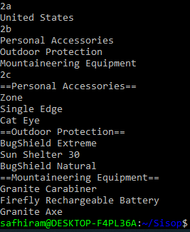
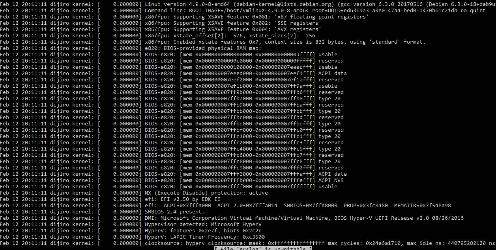
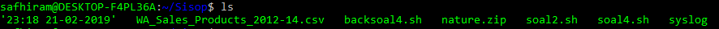
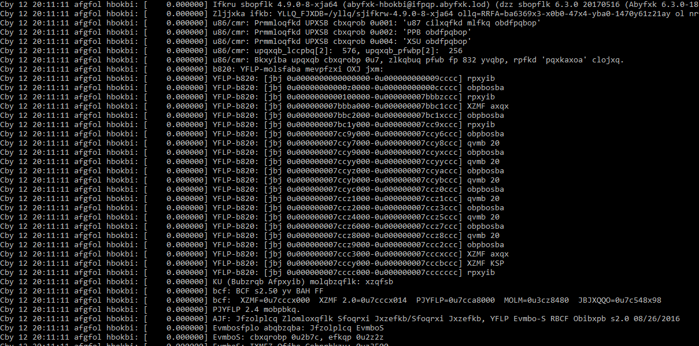

<h4>2.	Anda merupakan pegawai magang pada sebuah perusahaan retail, dan anda diminta untuk memberikan laporan berdasarkan file WA_Sales_Products_2012-14.csv. Laporan yang diminta berupa:</h4>
<h4>a.	Tentukan negara dengan penjualan(quantity) terbanyak pada tahun 2012.</h4>

```
var=$(awk -F "," '/,2012,/{a[$1]+=$10}END{for(i in a) print a[i],i}' WA_Sales_Products_2012-14.csv | sort -rn | awk 'NR==1 {print $2,$3}')
echo "$var" 
```
<h4>Penjelasan:</h4>
<p>Pada data yang ada di file WA_Sales_Products_2012-14.csv di pisahkan menggunakan tanda koma dengan menggunakan -F, Dari data tersebut diambil data dengan tahun 2012. Lalu data tersebut dikelompokkan berdasarkan kolom ke 1 , yang dikelompokkan adalah kolom ke-10(quantity). Lalu hasil disimpan di variabel i(isinya kolom ke satu), lalu di print quantity nya dan retailer country nya. Data tersebut di sort dan diambil baris pertama saja dan yang di print hanya kolom ke 2 dan 3. Quantity tidak di print.</p>

<h4>b.	Tentukan tiga product line yang memberikan penjualan(quantity) terbanyak pada soal poin a.</h4>

```
varb=$(awk -v country="$var" 'BEGIN {FS = ",";OFS=FS} $0 ~ country {iter[$4]+=$10} END{for(hasil in iter){print hasil,iter[hasil]}}' WA_Sales_Products_2012-14.csv | sort -nrk2 -t, | head -3 | awk 'BEGIN{FS=","} {print $1}') 
```

<h4>Penjelasan:</h4>
<p>Pada data yang ada di file WA_Sales_Products_2012-14.csv di pisahkan menggunakan tanda koma dengan menggunakan -F. Dari data tersebut diambil data dengan tahun 2012 dan berasal dari negara United States. Lalu data tersebut dikelompokkan berdasarkan kolom ke 4 , yang dikelompokkan adalah kolom ke 10(quantity). Lalu p ditaruh ke variabel result dan selanjutnya di print. Data tersebut di sort dan diambil tiga baris teratas, dan di print kolom ke 1.</p>

<h4>c.	Tentukan tiga product yang memberikan penjualan(quantity) terbanyak berdasarkan tiga product line yang didapatkan pada soal poin b.</h4>

```
echo "==Personal Accessories=="
awk -F ',' '{if($4=="Personal Accessories") iter[$6]+=$10} END {for(hasil in iter) {print iter[hasil],hasil}}' WA_Sales_Products_2012-14.csv  | sort -nr | awk 'NR<=3 {print $2,$3,$4}'

echo "==Outdoor Protection=="
awk -F ',' '{if($4=="Outdoor Protection") iter[$6]+=$10} END {for(hasil in iter) {print iter[hasil],hasil}}' WA_Sales_Products_2012-14.csv  | sort -nr | awk 'NR<=3 {print $2,$3,$4}'

echo "==Mountaineering Equipment=="
awk -F ',' '{if($4=="Mountaineering Equipment") iter[$6]+=$10} END {for(hasil in iter) {print iter[hasil],hasil}}' WA_Sales_Products_2012-14.csv  | sort -nr | awk 'NR<=3 {print $2,$3,$4}'
```

<h4>Penjelasan:</h4>
<p>Pada line 2 , Saat kolom ke-4(Product Line) adalah Personal Accessories atau Outdoor Protection atau Mountaineering Equipment maka Lalu data tersbut dikelompokkan berdasarkan kolom ke-6(product), yang dikelompokkan adalah kolom ke-10(quantity). Lalu hasil product yang telah dikelompokkan dimasukkan dalam variabel hasil lalu diprint quantity dan productnya. Dari data tersebut di sore dan diambil data 3 teratas</p>

<h4>Hasil:</h4>


<h4> 3.	Buatlah sebuah script bash yang dapat menghasilkan password secara acak sebanyak 12 karakter yang terdapat huruf besar, huruf kecil, dan angka. Password acak tersebut disimpan pada file berekstensi .txt dengan ketentuan pemberian nama sebagai berikut:</h4>
<h4>a.	Jika tidak ditemukan file password1.txt maka password acak tersebut disimpan pada file bernama password1.txt</h4>
<h4>b.	Jika file password1.txt sudah ada maka password acak baru akan disimpan pada file bernama password2.txt dan begitu seterusnya.</h4>
<h4>c.	Urutan nama file tidak boleh ada yang terlewatkan meski filenya dihapus.</h4>
<h4>d.	Password yang dihasilkan tidak boleh sama.</h4>
<br>

```
#!/bin/bash

name="password"

while [ 0 ]; do
num=1
cek=0

pass=$(cat /dev/urandom | tr -dc A-Za-z0-9 | head -c 12)
```
```
while test -e "$name$num.txt"; do
        if [ pass != $(echo $name$num.txt) ]; then

        echo $pass
        ((num++))
        else
        cek=1
        break
        fi
done
```
```
if [ $cek  ]; then
        echo $num $pass
        namafile="$name$num.txt"
        echo $pass > $namafile
        break
        fi
done
```

<h5>Penjelasan:</h5>
<p>1. Pertama buat variabel name dan num, sebagai nama file yang akan kita buat, yaitu namenum.txt
</p>
<p>2. buat sebuah password acak dengan perintah</p>

```
pass=$(cat /dev/urandom | tr -dc A-Za-z0-9 | head -c 12)

```
<p>3. cek apakah file dengan nama password yang kita inginkan sudah ada atau belum, jika sudah ada num++</p>
<p>4. jika belum ada, buat file dengan nama $name$num.txt dengan name = "password" </p>
<p>5. echo num dan pass y</p>
<p>6. password yang sudah kita buat dimasukan ke file </p>


<h4>4.	Lakukan backup file syslog setiap jam dengan format nama file “jam:menit tanggal-bulan-tahun”. Isi dari file backup terenkripsi dengan konversi huruf (string manipulation) yang disesuaikan dengan jam dilakukannya backup misalkan sebagai berikut:</h4>
<h4>a.	Huruf b adalah alfabet kedua, sedangkan saat ini waktu menunjukkan pukul 12, sehingga huruf b diganti dengan huruf alfabet yang memiliki urutan ke 12+2 = 14.</h4>
<h4>b.	Hasilnya huruf b menjadi huruf n karena huruf n adalah huruf ke empat belas, dan seterusnya. </h4>
<h4>c.	setelah huruf z akan kembali ke huruf a</h4>
<h4>d.	Backup file syslog setiap jam.</h4>
<h4>e.	dan buatkan juga bash script untuk dekripsinya.
</h4>


<h4>Isi dari file syslog</h4>

<h4>Isi dari file jam:menit tanggal-bulan-tahun</h4>



```
#!/bin/bash

#log=`cat syslog`
#dat= `date "+%H:%M %d-%m-%Y"`
hour=$(date +"%H")
dat=`date +"%H:%M %d-%m-%Y"`
sislol="/var/log/syslog"

low=abcdefghijklmnopqrstuvwxyz

#low=$(ord $log)
low=$low$low

#up=$(ord &log)
up=$(echo $low | tr [a-z] [A-Z])

cat $sislol | tr [${low:26}${up:26}] [${low:$hour:26}${up:$hour:26}] > "/home/safhiram/Sisop/$dat"<p>
```

<h4>Penjelasan:</h4>
<p>
Terdapat variabel</p>
<p>1. hour. Variabel ini berfungsi untuk menyimpan nilai jam pada saat ini </p>
<p>2. dat. Variabel ini berfungsi untuk menyimpan nilai jam:menit tanggal-bulan-tahun </p>
<p>3. sislol. Variabel ini berfungsi untuk menyimpan data dari file syslol </p>
<p>4. low. Variabel ini menyimpan huruf dari a sampai z, lalu kembali lagi dari a sampai z </p>
<p>5. up. Variabel ini menyimpan huruf kapital dari A sampai Z </p>

<p>diambil data dari variabel sislol lalu di translate (tr) sebanyak nilai dari variabel hour , lalu jawaban tersebut disimpan di file </p>

```
--deskripsi
#!/bin/bash

#log=`cat syslog`
#dat= `date "+%H:%M %d-%m-%Y"`
hour=$(date +"%H")
sislol=($(echo "$1"))
rot=$dat
low=abcdefghijklmnopqrstuvwxyz

#low=$(ord $log)
low=$low$low

#up=$(ord &log)
up=$(echo $low | tr [a-z] [A-Z])

rot=$((26-${sislol[0]}))

cat "$1" | tr "${up:0:26}" "${up:rot:26}" | tr "${low:0:26}" "${low:rot:26}" > "$1-balik"
```
<h4>Penjelasan:</h4>
<p>Terdapat variabel</p>
<p>1. hour. Variabel ini berfungsi untuk menyimpan nilai jam pada saat ini</p>
<p>2. sislol. Variabel ini berfungsi untuk menyimpan data dari file dari input yang dimasukkan</p>
<p>3. low. Variabel ini menyimpan huruf dari a sampai z, lalu kembali lagi dari a sampai z<p>
<p>4. up. Variabel ini menyimpan huruf kapital dari A sampai Z</p>
<p>5. rot. Variabel ini menyimpan 26 dikurangi dengan huruf yang ada di input sislol</p>

<p>diambil data dari variabel sislol lalu di translate (tr) sebanyak nilai dari variabel minus hour , lalu jawaban tersebut disimpan di file</p>
